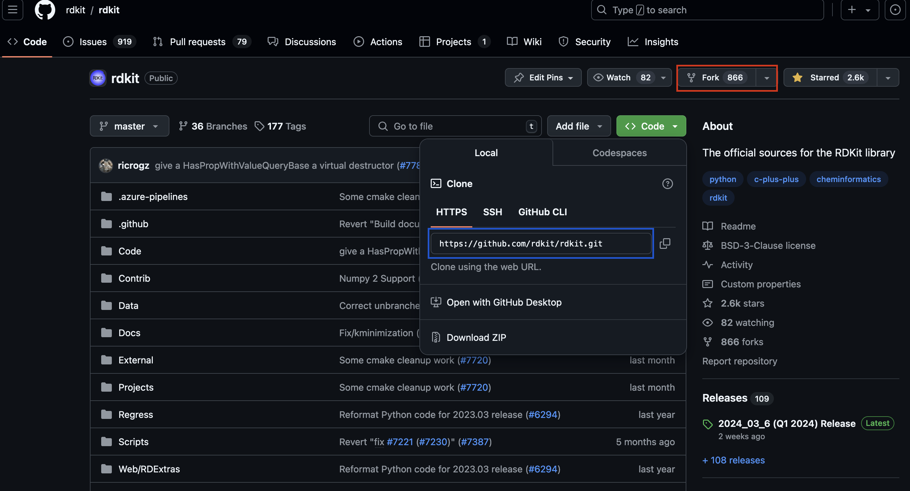
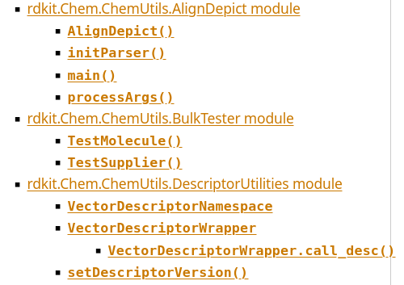

# Getting Started with Contributing to the RDKit

We are really happy to have new contributors help make the RDKit better. This document aims to provide an in-depth overview of what and how to make useful contributions to the RDKit community. 

## What and How to Contribute

### If you are not a developer

Really helpful things you can do that don't involve serious coding:

- Being an active part of the community and asking/answering questions on Github
- Submitting high-quality bug reports via [GitHub issues](https://github.com/rdkit/rdkit/issues)
- Contributing documentation
    - Fixing pieces you find to be unclear or wrong
    - Adding references where available 
    - Adding new sections or examples
    - In-code documentation: comments explaining what the code does or references
    - This Getting Started guide! 
- Contributing tutorials
- Ideas for improvements (with the appropriate tags!) 
- Write blog posts (either your own or for the [RDKit blog](https://greglandrum.github.io/rdkit-blog/))

#### GitHub Issues vs Discussions

If you have a question about the RDKit or aren't sure if what you're seeing is the right behavior please use the [Discussions tab](https://github.com/rdkit/rdkit/discussions) instead of posting it as an issue. More often than not the unexpected behaviour is an issue from your side - "guilty until proven innocent"!

The following code snippet using the `Chem.DetectChemistryProblem(mol)` function provides a good test for whether your observed behaviour is a true bug, or just input that RDKit doesn't like (mol.Debug() is also useful for this purpose):

```
m = Chem.MolFromSmiles('c1nccc1O(C)C',sanitize=False)
errs = Chem.DetectChemistryProblems(m)

OUTPUTS: Explicit valence for atom # 5 O, 3, is greater than permitted
OUTPUTS: Can't kekulize mol.  Unkekulized atoms: 0 1 2 3 4

errs[0].GetType()
OUTPUTS: 'AtomValenceException'

errs[0].Message(),errs[0].GetAtomIdx()
OUTPUTS: ('Explicit valence for atom # 5 O, 3, is greater than permitted', 5)

errs[1].GetType()
OUTPUTS: 'KekulizeException'

errs[1].GetAtomIndices()
OUTPUTS: (0, 1, 2, 3, 4)

errs[1].Message()
OUTPUTS: "Can't kekulize mol.  Unkekulized atoms: 0 1 2 3 4"
```

If you have a suggestion for a new RDKit feature or enhancement please consider starting a discussion about it using the Discussions tab before creating a pull request. Community input on how a feature could work is often helpful and it could be that there's already a way to do what you want to do in the RDKit.

If you are sure that what you're seeing is wrong behaviour, please use the template below as it will help understand the underlying bug report. If you do not provide the information requested we may not be able to help you and will probably close the issue. Issues should be reported [here](https://github.com/rdkit/rdkit/issues).

It is also possible to report a report a [vulnerability](https://github.com/rdkit/rdkit/security/advisories/).
This submission will only be viewable to repository maintainers and you will be credited if the advisory is published.

```
-----------------------------------------
TEMPLATE

**Describe the bug**
A clear and concise description of what the bug is.

**To Reproduce**
Steps to reproduce the behavior, feel free to paste a bit of Python in here.

**Expected behavior**
A clear and concise description of what you expected to happen.

**Screenshots**
If applicable, add screenshots to help explain your problem.

**Configuration (please complete the following information):**
 - RDKit version: 
 - OS: [e.g. Ubuntu 20.04]
 - Python version (if relevant):
 - Are you using conda?
 - If you are using conda, which channel did you install the rdkit from?
 - If you are not using conda: how did you install the RDKit?

**Additional context**
Add any other context about the problem here.

-----------------------------------------
```

Please mark all issues/discussions with the relevant tag!

### If you are a developer

Submitting new features and or bug fixes is certainly nice. For ideas on where to get started have a look at the [GitHub issues](https://github.com/rdkit/rdkit/issues). We try to remember to tag issues that are relatively small and self-contained as [good for beginners](https://github.com/rdkit/rdkit/labels/good%20for%20beginners); take a look at that list and see if there's anything that looks interesting. If you have questions, ask by adding a comment to the issue.

It’s generally a good idea to check with Greg or one of the maintainers before adding significant new functionality.

Code contributions can be made as follows:
- Core C++ functionality + relevant wrappers
- Python scripts
- JavaScript
- Java
- KNIME nodes

More details on what code contributions (including documentation) should look like are given in the following sections. 

### If you have 5 minutes to spare 

- Cleaning up GitHub issues that have been resolved or that should be under discussions
- Answering questions on the [GitHub Discussions](https://github.com/rdkit/rdkit/discussions) board or [Stack Overflow](https://stackoverflow.com/questions/tagged/rdkit)

### How to Submit Code/Docs Contributions

Contributions are made to the RDKit Codebase via GitHub pull requests. A summary of how to do this is given here. For a more in-depth overview see [this fantastic set of slides](https://github.com/rdkit/UGM_2016/blob/master/Presentations/Landrum_Schneider_GitHub_Git_and_RDKit.pdf) from Greg and Nadine. 

**Step 1** Create a fork of the main [RDKit repo](https://github.com/rdkit/rdkit) to your own GitHub account.

**Step 2** Clone from you fork to a local repo 

`git clone https://github.com/rdkit/rdkit.git`

**Step 2** Do code development on your local repository

**Step 3** Create and run tests locally 

**Step 4** Push your bug fix or new feature to your local repository
`git push`

**Step 5** Create a pull request to the [RDKit repo](https://github.com/rdkit/rdkit.git)


## Contributing to the RDKit Docs 

## Running the tests (C++ and Python)

Code changes should generally come with an associated unit test; also, please
run the tests to make sure your changes did not break any existing tests!
(If a test breaks, it may be a bug in your changes, or if the behavior change
is the point of the commit, the old test may need to be updated.)

The unit tests are run from the build directory (`$RDBASE/build`) using the
[ctest](https://cmake.org/cmake/help/latest/manual/ctest.1.html) command. See
the help message for a full list of options, but some frequently useful options
include:

    -j <n>               Run in parallel with <n> workers
    -N                   Only list the tests that would be run
    -R <regex>           Only run tests matching a regular expression
    --output-on-failure  Print the stdout/stderr of failing tests

## Contributing to the Code - Python 

This guide already assumes that you are familiar with [the rdkit basics](https://www.rdkit.org/docs/GettingStartedInPython.html), version control with [Git](https://git-scm.com/) and GitHub features such as commits and pull requests. If not, there is a very [neat presentation from UGM 2016](https://github.com/rdkit/UGM_2016/blob/master/Presentations/Landrum_Schneider_GitHub_Git_and_RDKit.pdf) that you should definitely look at before you start.


### Setting up your Environment

Wim summarizes and links whatever is here: https://github.com/rdkit/rdkit/issues/3052

Instructions how to setup IDE are here: https://github.com/rdkit/rdkit/issues/3052 . Extended instruction on how to set up your environment for Python development are here in a post on the [RDKit blog](https://greglandrum.github.io/rdkit-blog/posts/2020-03-30-setting-up-an-environment.html). At the bottom, it includes a recipe for cloning a local fork on which you can then run and test the updated code.


### Coding Style

RDKit does not at the moment has a dedicated style guide or linter setup that you should use for Python. However, there are a few rules that you might want to adhere to so that the code and API design stays coherent (sidenote: it is currently not):

- Use `CamelCase` for `PackageNames`, `ModuleNames`, `ClassNames`, `MethodNames`, `FunctionNames`, but note the different style for `functionAttributeNames` and `methodAttributeNames`
 - These recommendations are made based on the most commonly found patterns in the `Chem` module. However, you may see small inconsistencies here and then...
   - 
- Use `snake_case` names for local variables inside methods and functions. However, `justlowercase` is also fine.
- Use multi-line Python strings to document modules and methods, i.e.:

 ```python
 def xy():
    """ This is a documentation string.
    
    It is continued here...
    """
    pass
 ```
- Use double quotes (`"`) for string literals.

## Contributing to the Code - C++

### A note on Modern C++

In order to continue to allow the code to be built on older systems, the RDKit
is currently using a subset of what's available in modern C++ compilers. The
latest language standard supported by the RDKit is C++17; the expectation is
that it should be possible to build the RDKit with g++ v8.0.

### Naming conventions

We use camelCase for everything.

Class and namespace names start with an upper-case letter, i.e.
`ExplicitBitVect` or `MolFragmenter`. Function and method names start with a
lower-case letter, e.g. `ROMol::getNumAtoms()`.

### Formatting

We are following the formatting suggestions from [Google's C++ style
guidelines](https://google.github.io/styleguide/cppguide.html). We strongly
suggest using an auto-formatter like
[clang-format](http://clang.llvm.org/docs/ClangFormat.html) to do the
formatting. Clang-format can be integrated with editors like emacs, vim, or
atom to automatically format code as you write/save it. It's an amazing time
saver! *Note* that at least version 3.8 of clang-format is required,
unfortunately the configuration files are not backwards compatible.

There is a .clang-format config file at the root of the repository; code layout
should be based on this configuration.

### Adding a new unit test

New unit tests should use the Catch2 test framework ([https://github.com/catchorg/Catch2](https://github.com/catchorg/Catch2)). Test files are called “catch\_something.cpp”, and are placed directly in the code folders. If you contribute a small change / bug-fix, you don't need a new file, but just add a TEST\_CASE. Example:

```c++
TEST_CASE("test basic Mol features", "[ROMol]") {
  SECTION("basics") {
    {
      // shortcut to create a molecule from SMILES
      auto m = "CCO"_smiles;
      // check that the molecule was created successfully
      REQUIRE(m);
      // test some functionality
      int nAtoms = m->getNumAtoms();
      CHECK(nAtoms == 3);
    }
  }
}
```

### Adding a new test file

For larger features, you can create a separate test file “catch\_myfeature.cpp” in the respective folder:

```c++
#include "RDGeneral/test.h"
#include <catch2 /catch_all.hpp>
#include <GraphMol /SmilesParse/SmilesParse.h>

using namespace RDKit;

TEST_CASE("test basic Mol features", "[ROMol]") {
  SECTION("basics") {
    {
    // shortcut to create a molecule from SMILES
    auto m = "CCO"_smiles;
    // check that the molecule was created successfully
    REQUIRE(m);
    // test some functionality
    int nAtoms = m->getNumAtoms();
    CHECK(nAtoms == 3);
    }
  }
}
```

Additionally, adapt the CMakeLists.txt of the respective folder. You will have to adapt filenames and add needed libraries (in this example, FileParsers contains the functionality to parse SMILES.

```
rdkit_catch_test(dummyTest catch_dummy.cpp LINK_LIBRARIES FileParsers)
```

## Miscellaneous Contributions

### Java

### JavaScript

### Tutorials

### KNIME nodes
